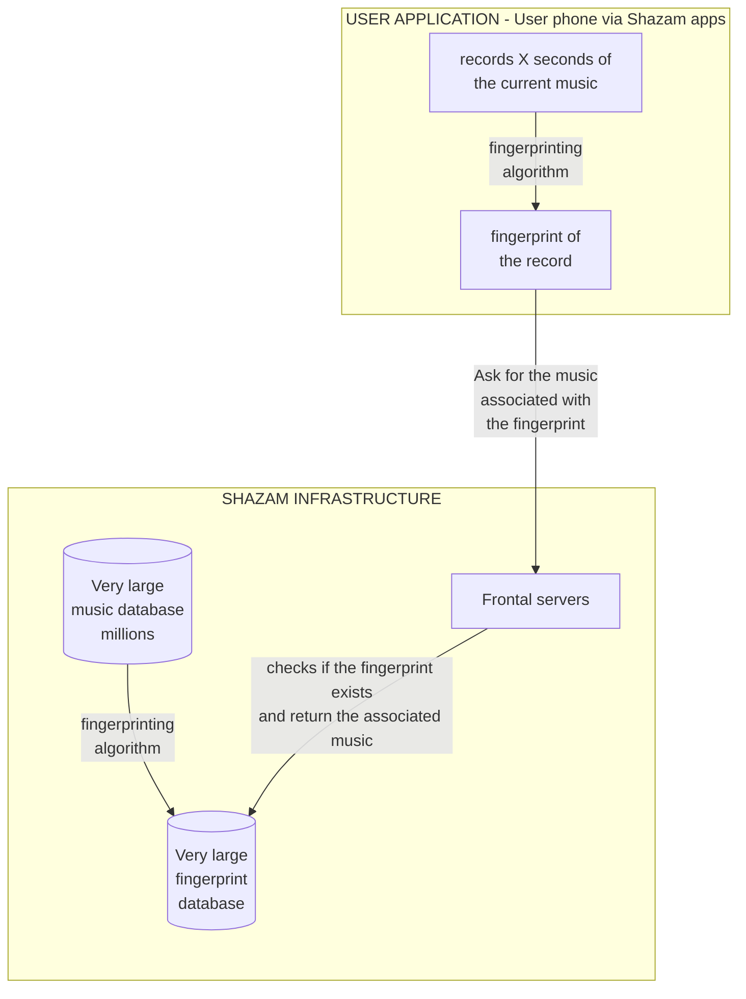

# Shazam
> A recreation of the Shazam music recognition algorithm.

## Overview
This project aims to recreate the core algorithm behind Shazam's audio acoustic recognition capabilities, utilizing audio fingerprinting and fast database lookups. 

## Technical Architecture

The following diagram maps out the data pipeline from registering tracks into the main database, to how user devices capture audio snippets and match them against the huge reference database.

## How It Works

The core of the algorithm is based on creating robust identifiers for audio clips that can survive noise, distortion, and compression.

1. **Fingerprinting Algorithm:** 
   Audio files are processed to extract a spectrogram. From this spectrogram, "constellation maps" are created by finding peaks in the frequency domain (the most prominent frequencies at any given time). These peaks are grouped into pairs (target zones) to create robust hashes that are invariant to small time shifts and continuous background noise.

2. **Database Generation (Infrastructure):**
   A massive catalog of original music is processed by the fingerprinting algorithm. The result is stored in a highly optimized fingerprint database containing millions of hashes mapped to their associated songs and relative timestamps.

3. **User Query (Application):**
   When a user wants to identify a song, the application records a short audio sample. This sample undergoes the exact same fingerprinting algorithm natively on the device to produce a set of query hashes.

4. **Matching & Retrieval:**
   These query hashes are sent to the frontal APIs, which look them up in the fingerprint database. The server checks for hash matches, and crucially, verifies the **temporal alignment** of the matches (ensuring the sequence of hashes occurs in the same chronological order as the original track). If a significant number of matches align on a consistent timeline, the song is successfully identified.

## Features
- **Acoustic Fingerprinting:** Fast and scalable audio hashing mechanisms.
- **Noise Robustness:** Designed to identify tracks even with significant ambient background noise.
- **Fast Lookups:** Efficient multi-hash matching utilizing offset-based time alignment heuristics.
